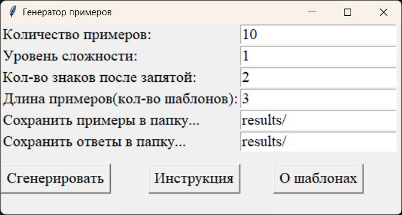

# Генератор примеров

Программа для генерации случайных школьных алгебраических примеров, используя пользовательские шаблоны (реализация 2021г.)

Добро пожаловать в Генератор Примеров!!!

Наша программа способна сгенерировать любое количество примеров
любой сложности. На выходе программа выдает текстовый файл примеров
и текстовый файл ответов, по умолчанию они помещаются в папку results
каталога программы Генератор примеров. Для генерации примеров, программа
использует конструкции (шаблоны) составляя из них выражения. По-умолчанию,
шаблоны разделены на три уровня сложности и хранятся в 3-х соответствующих 
файлах (template1.txt, template2.txt, template3.txt) в папке templates в каталоге Генератор 
примеров. При генерации примеров можно указать следующие параметры:
1. количество примеров;
2. сложность примеров;
3. количество знаков после запятой;
4. длина примеров (количество используемых шаблонов в примере).

Шаблоны можно редактировать или добавлять новые.

## Инструкция

Примеры формируются на основе шаблонов, пользователь может добавлять свои шаблоны.

Шаблоны делятся на уровни сложности, соответствующие числу в конце имени файла temple.txt.

Шаблон - это выражение, указанное в отдельной строке. Шаблонов в файле может быть любое количество. Каждый шаблон
может состоять из 2-х переменных (х, а), круглых и квадратных скобок и математических знаков +, -, *, /, ^) и любых
рациональных непериодических чисел.

* х - это дробное десятичное число;
* а - это целое число;

Шаблон должен быть ограничен круглыми скобками. Конечный пример составляется из шаблонов с помощью сложения,
вычитания, умножения, выбранных произвольным образом, при этом вместо квадратных скобок подставляется значение
выражения в них. Примеры шаблонов уже помещены в файлы temple1.txt, посложнее в temple2.txt, самые сложные в temple3.txt.
Все конечные примеры сформированные по таким шаблонам будут иметь "красивый" ответ - целое число. Благодаря тому,
что каждое выражение шаблона, независимо от подставляемых в переменные чисел, дает целый ответ.

Правило составления шаблонов:
1. Выражения в квадратных скобках должны компенсировать оставшуюся часть шаблона без квадратных скобок так, чтобы
значение шаблона было целым. Наример:(х+[a-x]) при любых а и х будет равно а(целое число).
2. После последнего шаблона в файле необходимо нажать Enter.

P.S. Уже созданные 3 файла шаблонов способны формировать достаточно большое разнообразие
примеров. Но данная инструкция позволит Вам увеличить их разнообразие.

